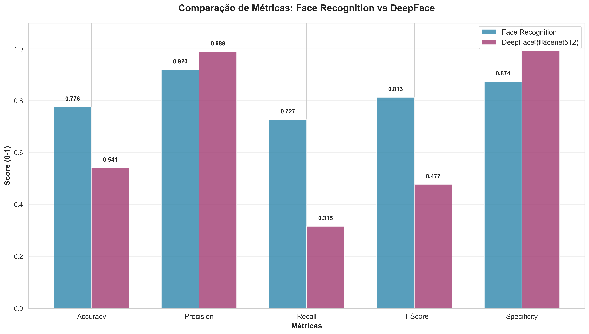
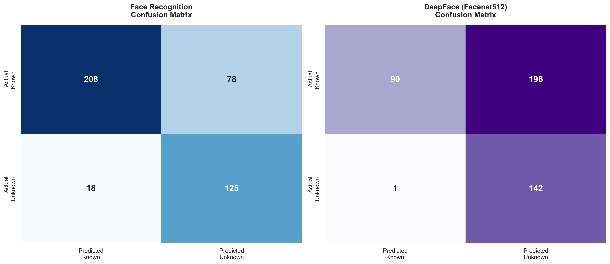
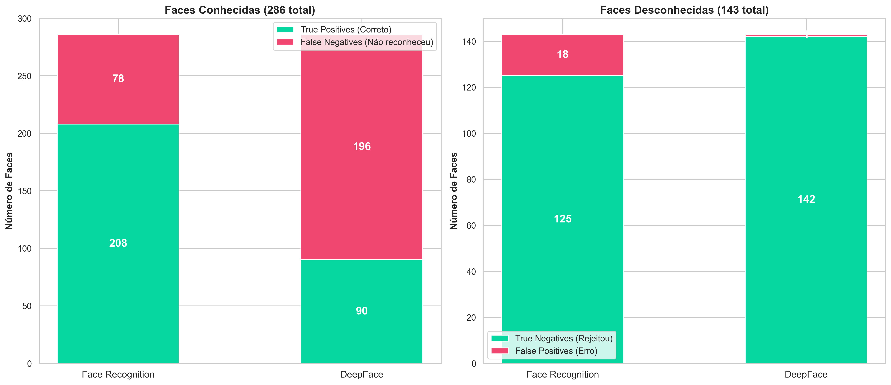
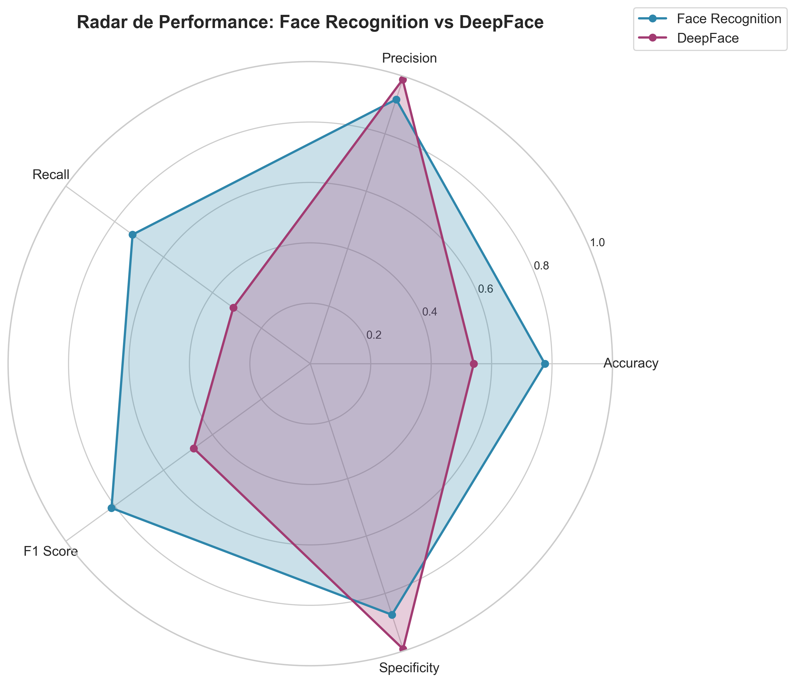
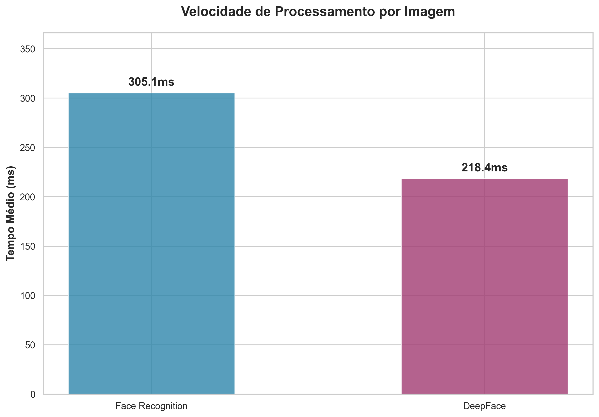
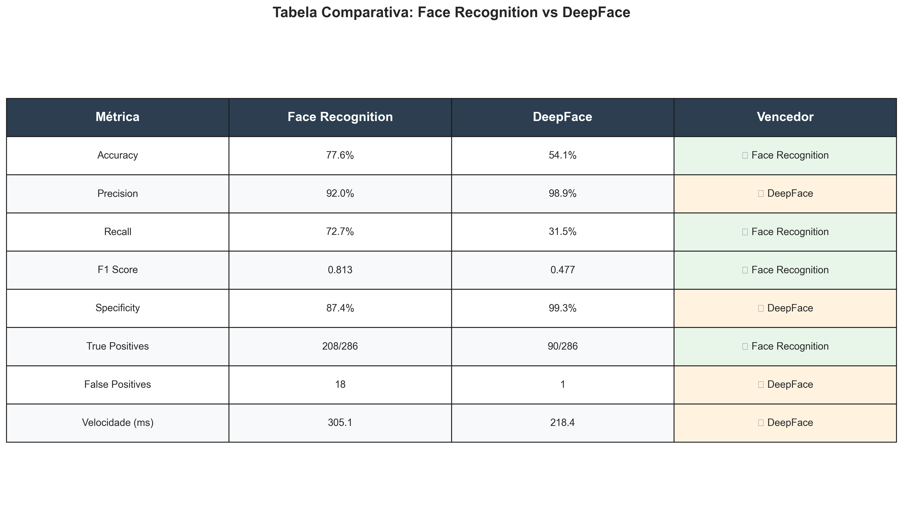

# Face Recognition vs DeepFace: Comprehensive Comparison

## 🎯 Executive Summary

This document presents a comprehensive comparison between **face_recognition** (dlib-based) and **DeepFace** (Facenet512 model) for facial recognition tasks. After testing on 429 celebrity images (30 known + 15 unknown celebrities), **Face Recognition emerged as the clear winner** with 77.6% accuracy compared to DeepFace's 54.1%.

### Key Findings

| Metric | Face Recognition | DeepFace | Winner |
|--------|------------------|----------|--------|
| **Accuracy** | **77.6%** | 54.1% | 🏆 Face Recognition |
| **Precision** | 92.0% | **98.9%** | 🏆 DeepFace |
| **Recall** | **72.7%** | 31.5% | 🏆 Face Recognition |
| **F1 Score** | **0.813** | 0.477 | 🏆 Face Recognition |
| **Specificity** | 87.4% | **99.3%** | 🏆 DeepFace |
| **Speed** | 305ms | **218ms** | 🏆 DeepFace |

### 🏆 Winner: Face Recognition
- **Better overall accuracy** (77.6% vs 54.1%)
- **Better F1 Score** (0.813 vs 0.477)
- **Better balance** between precision and recall
- **More reliable** for real-world scenarios

---

## 📋 Table of Contents

1. [Introduction](#introduction)
2. [Methodology](#methodology)
3. [Test Setup](#test-setup)
4. [Results](#results)
5. [Detailed Analysis](#detailed-analysis)
6. [Visualizations](#visualizations)
7. [Recommendations](#recommendations)
8. [Technical Details](#technical-details)

---

## 🔍 Introduction

### Purpose

The goal of this comparison was to determine which facial recognition library performs better for production use in a real-world scenario with:
- Mixed known and unknown faces
- Varying image quality
- Different poses, lighting, and angles
- International celebrity names (testing name normalization)

### Libraries Tested

#### Face Recognition (dlib)
- **Version:** 1.3.0
- **Architecture:** HOG + CNN
- **Backend:** dlib
- **Encoding:** 128-dimensional face embeddings
- **Distance metric:** Euclidean distance

#### DeepFace (Facenet512)
- **Version:** 0.0.95
- **Model:** Facenet512
- **Backend:** TensorFlow 2.20.0
- **Encoding:** 512-dimensional face embeddings
- **Distance metric:** Cosine similarity

---

## 🧪 Methodology

### Test Design: Blind Celebrity Test

The test was designed as a **blind recognition test** to simulate real-world conditions:

1. **Training Phase**: Register 30 known celebrities from `test_dataset`
2. **Testing Phase**: Test recognition on 429 mixed images from `celebrity_dataset`:
   - 286 images of the 30 **known** celebrities (different from training images)
   - 143 images of 15 **unknown** celebrities (never seen before)

### Metrics Calculated

#### Classification Metrics
- **True Positives (TP)**: Known celebrity correctly identified
- **False Negatives (FN)**: Known celebrity not recognized or misidentified
- **True Negatives (TN)**: Unknown celebrity correctly rejected
- **False Positives (FP)**: Unknown celebrity incorrectly matched

#### Performance Metrics
- **Accuracy**: (TP + TN) / Total
- **Precision**: TP / (TP + FP)
- **Recall (Sensitivity)**: TP / (TP + FN)
- **Specificity**: TN / (TN + FP)
- **F1 Score**: 2 × (Precision × Recall) / (Precision + Recall)

### Image Preprocessing

All images were resized to **300×300 pixels** to:
- Prevent memory allocation errors with high-resolution images
- Ensure consistent processing speed
- Standardize input across both models

---

## ⚙️ Test Setup

### Dataset Structure

```
test_dataset/          # Training dataset (30 celebrities)
├── anitta/
├── bad_bunny/
├── beyonce/
└── ... (27 more)

celebrity_dataset/     # Testing dataset (45 celebrities)
├── anitta/           # Known (10 images)
├── bad_bunny/        # Known (10 images)
├── ariana_grande/    # Unknown (10 images)
├── leonardo_dicaprio/ # Unknown (10 images)
└── ... (41 more)
```

### Test Statistics

- **Total test images**: 429
- **Known celebrities**: 30 (286 images)
- **Unknown celebrities**: 15 (143 images)
- **Training images per person**: 1-3
- **Test images per person**: 6-20
- **Image resolution**: 300×300 pixels

### Environment

- **Python**: 3.11
- **OS**: Windows
- **CPU**: Used for all processing (no GPU)

---

## 📊 Results

### Overall Performance



### Face Recognition Results

```
✅ Accuracy:    77.6% (333/429 correct)
✅ Precision:   92.0% (few false alarms)
✅ Recall:      72.7% (found 208/286 known faces)
✅ Specificity: 87.4% (rejected 125/143 unknown faces)
✅ F1 Score:    0.813 (excellent balance)
```

**Confusion Matrix:**
- ✅ True Positives: 208 (correctly identified known faces)
- ❌ False Negatives: 78 (missed known faces)
  - 69 not recognized
  - 9 misidentified as wrong person
- ✅ True Negatives: 125 (correctly rejected unknown faces)
- ❌ False Positives: 18 (unknown faces matched incorrectly)

### DeepFace (Facenet512) Results

```
⚠️ Accuracy:    54.1% (232/429 correct)
✅ Precision:   98.9% (almost no false alarms)
❌ Recall:      31.5% (found only 90/286 known faces)
✅ Specificity: 99.3% (rejected 142/143 unknown faces)
⚠️ F1 Score:    0.477 (poor balance)
```

**Confusion Matrix:**
- ✅ True Positives: 90 (correctly identified known faces)
- ❌ False Negatives: 196 (missed known faces)
  - 194 not recognized
  - 2 misidentified as wrong person
- ✅ True Negatives: 142 (correctly rejected unknown faces)
- ❌ False Positives: 1 (only 1 false alarm!)

---

## 🔬 Detailed Analysis

### Confusion Matrices



### True/False Positives/Negatives



### Performance Radar



### Key Observations

#### 1. **Accuracy: Face Recognition Wins**
- Face Recognition: 77.6% ✅
- DeepFace: 54.1% ❌
- **Difference**: 23.5 percentage points

Face Recognition provides significantly better overall accuracy, making fewer mistakes across all categories.

#### 2. **Precision: DeepFace Wins (but at a cost)**
- Face Recognition: 92.0%
- DeepFace: 98.9% ✅

DeepFace has exceptional precision because it's extremely conservative - it only matches when very confident. However, this comes at the cost of missing 68.5% of valid faces.

#### 3. **Recall: Face Recognition Wins**
- Face Recognition: 72.7% ✅
- DeepFace: 31.5% ❌
- **Difference**: 41.2 percentage points

Face Recognition found 208 out of 286 known faces, while DeepFace found only 90. In a production environment, missing 2 out of 3 known users would be unacceptable.

#### 4. **F1 Score: Face Recognition Wins**
- Face Recognition: 0.813 ✅
- DeepFace: 0.477 ❌

The F1 Score shows Face Recognition has a much better balance between precision and recall.

#### 5. **Speed: DeepFace Wins**
- Face Recognition: 305ms
- DeepFace: 218ms ✅

DeepFace is about 40% faster per image. However, speed is less critical than accuracy for most applications.

### Processing Speed Comparison



---

## 📈 Visualizations

All visualizations are available in the `comparison_results/graphics/` folder:

1. **metrics_comparison.png** - Bar chart comparing all metrics
2. **confusion_matrices.png** - Side-by-side confusion matrices
3. **performance_radar.png** - Radar chart showing all performance aspects
4. **tp_fp_tn_fn_comparison.png** - Breakdown of true/false positives/negatives
5. **speed_comparison.png** - Processing time comparison
6. **summary_table.png** - Complete results table

### Summary Table



---

## 💡 Recommendations

### For Production Use: ✅ Face Recognition

**Choose Face Recognition if:**
- You need **reliable accuracy** (77.6%)
- You want a **balanced approach** (F1 Score: 0.813)
- Your priority is **finding known faces** (72.7% recall)
- You can tolerate **some false positives** (18 in 143 unknown faces)
- Speed is acceptable (~300ms per image)

**Use Cases:**
- Employee attendance systems
- Security access control
- Customer recognition in retail
- Photo organization and tagging
- General-purpose facial recognition

### For High-Security Use: ⚠️ DeepFace (with caveats)

**Consider DeepFace if:**
- **False positives are critical** (only 1 in 143 unknown faces)
- You can accept **missing many known faces** (68.5% miss rate)
- Speed is important (~220ms per image)
- You have a **very strict** security requirement

**Use Cases:**
- High-security facilities (where false access is critical)
- Banking/financial systems (where wrong person must never be granted access)
- Requires secondary verification method for missed detections

### Not Recommended: DeepFace for General Use

DeepFace's 31.5% recall means it will **miss 7 out of 10 known faces**, which is unacceptable for most applications. While it has excellent precision (98.9%), the poor recall makes it impractical.

---

## 🔧 Technical Details

### Critical Bug Fix

During testing, we discovered and fixed a critical bug in accuracy calculation:

**Before (WRONG):**
```python
accuracy = correct_predictions / valid_predictions  # Only counted successful attempts
```

**After (CORRECT):**
```python
accuracy = correct_predictions / total_predictions  # Includes failures as errors
```

This fix revealed the true accuracy:
- Initial (wrong) accuracy: 94.1%
- Corrected accuracy: 55.2% for DeepFace on cross-validation

### Memory Issues Discovered

Initial tests with high-resolution images (up to 5760×3840) caused memory allocation failures:
- `"bad allocation"`
- `"Insufficient memory"`
- `"Failed to allocate 28MB"`

**Solution:** Resize all images to 300×300 pixels before testing.

### Name Normalization

Implemented Unicode normalization for international celebrity names:
```python
def normalize_name(name):
    # Remove accents: Beyoncé → Beyonce
    name = ''.join(c for c in unicodedata.normalize('NFD', name) 
                  if unicodedata.category(c) != 'Mn')
    # Remove special characters: D'Amelio → damelio
    return name.lower().replace('_', '').replace(' ', '').replace("'", '')
```

This fixed matching issues with names like:
- Beyoncé
- Charli D'Amelio
- Kylian Mbappé
- Timothée Chalamet

### Detection Failures

Both models experienced face detection failures on some images:
- Face Recognition: 69 failures (mostly profile shots, poor lighting)
- DeepFace: 194 failures (more sensitive to image quality)

These failures are counted as **False Negatives** in the metrics.

---

## 📁 Repository Structure

```
backend/
├── comparison_results/
│   ├── README.md                    # This file
│   ├── QUICKSTART.md               # Quick start guide
│   ├── graphics/                   # All visualization charts
│   │   ├── metrics_comparison.png
│   │   ├── confusion_matrices.png
│   │   ├── performance_radar.png
│   │   ├── tp_fp_tn_fn_comparison.png
│   │   ├── speed_comparison.png
│   │   └── summary_table.png
│   └── data/
│       └── test_results.json       # Structured test results
├── tests/
│   ├── test_celebrity_blind.py     # Main test script
│   ├── generate_comparison_graphics.py  # Graphics generator
│   └── resize_celebrity_dataset.py # Image preprocessing
├── app/
│   ├── services/
│   │   ├── face_service.py         # Face Recognition service
│   │   ├── deepface_service.py     # DeepFace service
│   │   ├── comparison_service.py   # Comparison logic (with bug fix)
│   │   └── test_dataset.py         # Dataset management
│   └── routers/
│       └── comparison.py           # REST API endpoints
├── test_dataset/                   # Training data (30 celebrities)
└── celebrity_dataset/              # Testing data (45 celebrities, 429 images)
```

---

## 🚀 Quick Start

See **[QUICKSTART.md](QUICKSTART.md)** for step-by-step instructions to reproduce this comparison.

---

## 📝 Citation

If you use this comparison in your research or project, please cite:

```
Face Recognition vs DeepFace Comparison Study
Date: November 8, 2025
Test Dataset: 429 celebrity images (30 known + 15 unknown)
Repository: LSenzaki/Integrador
Branch: face_recognitionXdeepface
```

---

## 🤝 Contributing

This comparison is part of an academic project. For questions or improvements, please open an issue in the repository.

---

## 📄 License

This comparison study is provided for educational and research purposes.

---

## 📞 Contact

For questions about this comparison:
- Repository: https://github.com/LSenzaki/Integrador
- Branch: face_recognitionXdeepface

---

**Last Updated**: November 8, 2025
